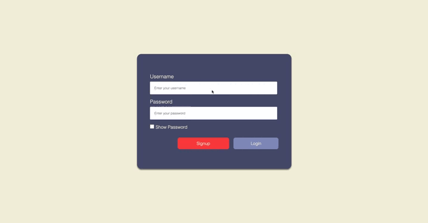
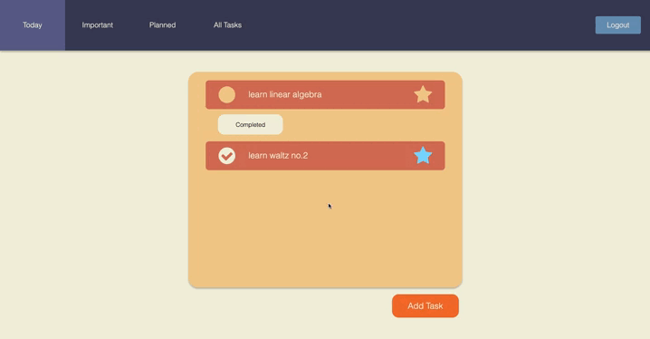
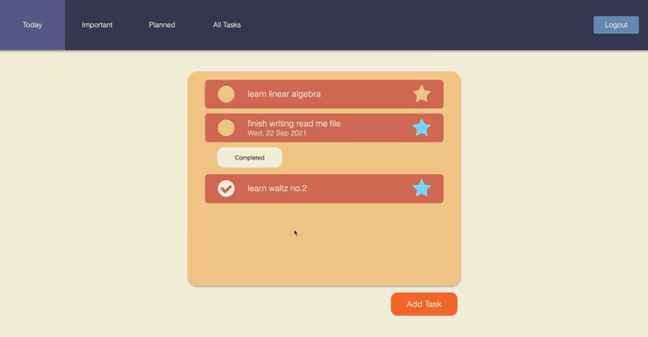
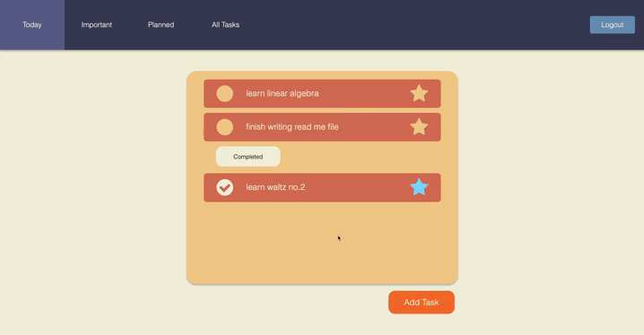
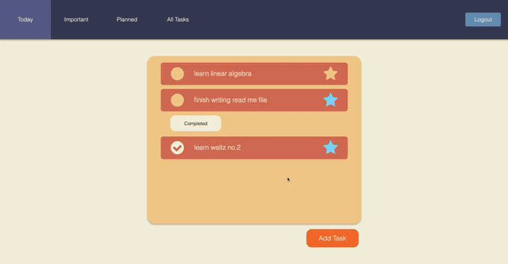

# TodoList-App

TodoList-App is a Todo List web app written in Go and vanilla JavaScript.

# Demo

1. [Login](#login)
2. [Signup](#signup)
3. [Add Task](#add-task)
4. [Update Task](#update-task)
5. [Mark Task as Important and/or Completed](#markImpCmpl)
6. [Delete Task](#elete-task)
7. [Logout](#logout)

## Login

## Signup

## Add Task

## Update Task

### Mark Task as Important and/or Completed

## Delete Task

## Logout

